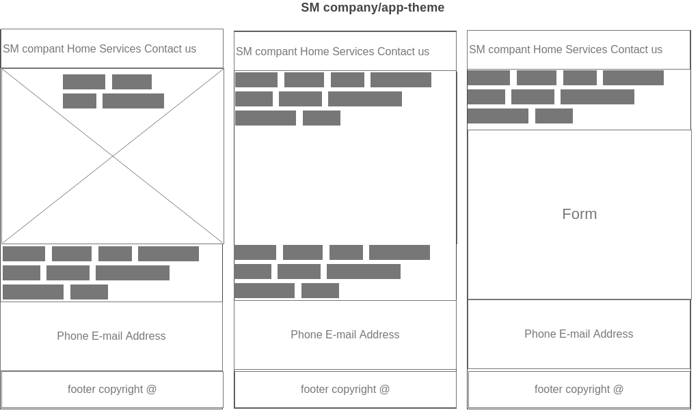

# Development Strategy

> `app-theme`

<!--write a short description of your project:
- who would want to use it?
- why would they want to use it? -->

- This project is a simple website, build using HTML ,CSS and CSS flexbox grid .
  Most of the work is done using CSS flexbox grid as a powerful tool uses to organize  items inside a container more efficiently . CSS flexbox grid is an easy tool to orginze different items more efficintly and easily.

- This project is useful for beginners in web development , who are learning HTML, CSS and CSS flexbox grid or anyone who is eager to learn coding and web development.
 

## Wireframe

<!-- include a wireframe for your project in this repository, and display it here -->
<!-- wireframe.cc is a good site for getting started with wireframes -->

## 0- Understanding the project:

- watching the tutorial `app-theme from Traversy Media` carefully .
- reading HYF class materals and homework.

## 1- Create a repo and clone it :

- Generate a repo from Template (w3-validation-template ) and rename it `app-theme`)
- write initial, basic README.
- turn on GitHub Pages.
- clone the repo to my Pc.

## 2.Create a project board :

- Create a project board `app-theme-project-board`.
- Add an extra column to the board `ready for review`.

## 3.Create a branch `1-Home` :

- Create a branch by the name `1-Home` 
- Checkout `1-Home` 
- Add code to index HTML file
- `index.html`
   - add the `head` tage.
      - `head`
        - the title `SM for electronic services`
        - meta tags ( viewport ,  utf-8 , and description )
        - links to google fonts.
        - links to icon ( specific icon shows two laptop)
        - link to google fonts 
        - link to flexboxgrid.css
        - link to style.csS
        
    - add the `body` tage .
      - `body`
        - add the `header`
        - create a container , `div` for the the container , row and column 
        - add the header `h1`
        - add `div` for coulmn 
        - add navigation bar.
        - add `section` show-case , add `div` for container , row and colmun 
        - add `h2` and `p`
        - add `section` with `div` for container , row and columns 
        - add `h2` and `p` 
        - add `div` for each images 
        - add `div` for row and column 
        - add `div` for each `h2` and `p`
        - add `section` add `div` for conatiner , row and cloumn 
        - add `div` for each image 
        - add `div` for coulmn , the `div` for each `h5`
        - add `footer`  then add `div` for container , row and column
        - add `p`
- Add it to the staging area and commit it 
- Push to GitHub
- merge with master

## 4.Create a branch `2-services`:

- Create a branch by the name `2-services` 
- Checkout `2-services` 
- Add code to services HTML file
  - add the `head` tage.
     - add the `head` tage.
      - `head`
        - the title `SM for electronic services`
        - meta tags ( viewport ,  utf-8 , and description )
        - links to google fonts.
        - links to icon ( specific icon shows two laptop)
        - link to google fonts 
        - link to flexboxgrid.css
        - link to style.csS
        
    - add the `body` tage .
      - `body`
        - add the `header`
        - create a container , `div` for the the container , row and column 
        - add the header `h1`
        - add `div` for coulmn 
        - add navigation bar.
        - add `section` show-case , add `div` for container , row and colmun 
        - add `h2` and `p`
        - add `section` with `div` for container , row and columns 
        - add `h2` and `p` 
        - add `div` for each `h2` and `p`
        - add `section` add `div` for conatiner , row and cloumn 
        - add `div` for each image 
        - add `div` for coulmn , the `div` for each `h5`
        - add `footer`  then add `div` for container , row and column
        - add `p`
- merge the `2-services` with the master branch.
- Add it to the staging area and commit it 
- Push to GitHub
- merge with master

## 5.Create a branch `3-contactus`:

- Create a branch by the name `3-contactus` 
- Checkout `3-contactus` 
- Add code to contactus HTML file
- `aboutUs`
  - add the `head` tage.
    - `head`
        - the title `SM for electronic services`
        - meta tags ( viewport ,  utf-8 , and description )
        - links to google fonts.
        - links to icon ( specific icon shows two laptop)
        - link to google fonts 
        - link to flexboxgrid.css
        - link to style.csS
        
    - add the `body` tage .
      - `body`
        - add the `header`
        - create a container , `div` for the the container , row and column 
        - add the header `h1`
        - add `div` for coulmn 
        - add navigation bar.
        - add `section` show-case , add `div` for container , row and colmun 
        - add `h2` and `p`
        - add `section` with `div` for container , row and columns 
        - add `h4`  
        - add `from`
        - add `div` for each input  and button
        - add `section` add `div` for conatiner , row and cloumn 
        - add `div` for each image 
        - add `div` for coulmn , the `div` for each `h5`
        - add `footer`  then add `div` for container , row and column
        - add `p`
- Add it to the staging area  and commit it 
- Push to GitHub
- merge with master

## 6.Create a branch `style` :

- Create a branch by the name `style` 
- Checkout `style` 
- Add code to style CSS file
- - `style.css`

  - `*`, 
    - make padding and margin zero.
  - `body`

    - add padding and margin zero.
  - `img`
    - width 20% 
  - `container`
    - margin auto
  - `main-header`
    - add text-align , color,background-color,margin, padding , border
  - `class"main-nav"`
    - add text-align , font-family , padding, font size 
  - `show-case`
    - add width , background images , border 
  - `features`
    - background ,font-family , padding, border
  - `contact`
    - background color  , margin, color ,padding
  - `form input class `
    - color, width, margin , background color 
  - `p` color , font and padding 
    - width, margin, background-color
- Add images 
- Add it to the staging area and commit it 
- Push to GitHub
- merge with master
  

### Repo

what branch(es) did you work on?
1-home
2-services
3-contactus
style
master

### HTML

what did you change in the HTML and why?

Add , google fonts , add images instead of icons , change the column width for head and show-case,
chaange . 
why?

 I find it more flexible this way and I wanted to changed it accodring to my web site  

### CSS

what did you change in the CSS and why?

padding , border , images , background , color , font , classes instead of ids 
why?

more flexable and usable more than once .

## Finishing Touches

- Write final, complete README:
  - [makeareadme.com](https://www.makeareadme.com/)
  - [bulldogjob](https://bulldogjob.com/news/449-how-to-write-a-good-readme-for-your-github-project)
  - [meakaakka](https://medium.com/@meakaakka/a-beginners-guide-to-writing-a-kickass-readme-7ac01da88ab3)
- Validate code to check for any last mistakes
